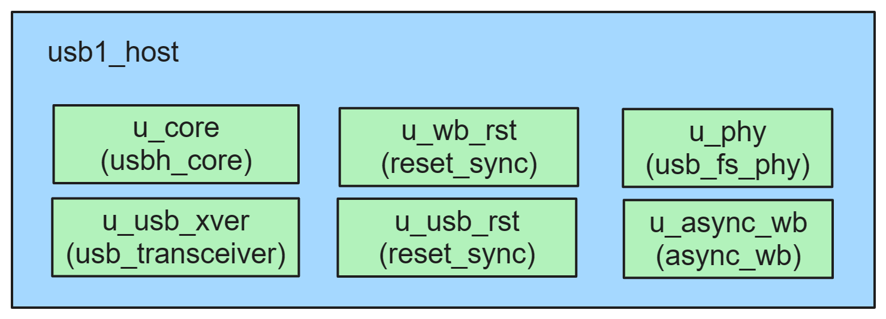
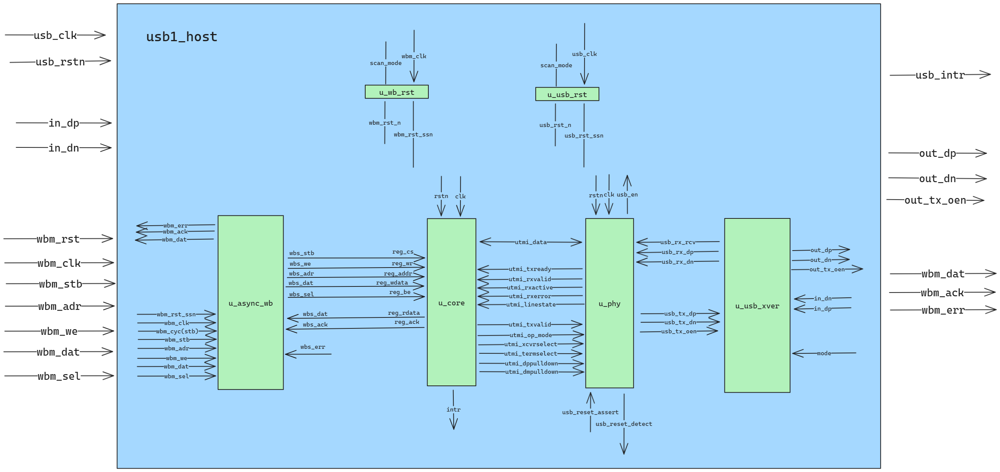
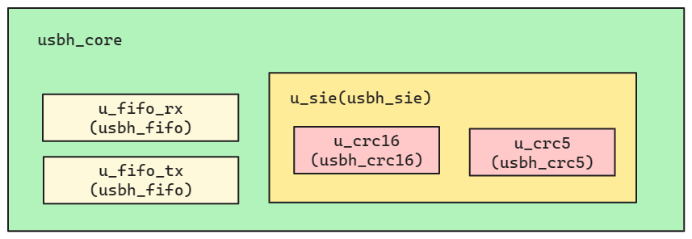
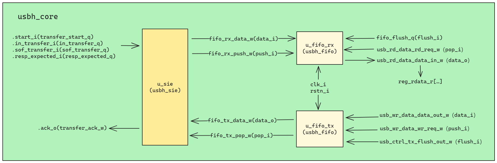
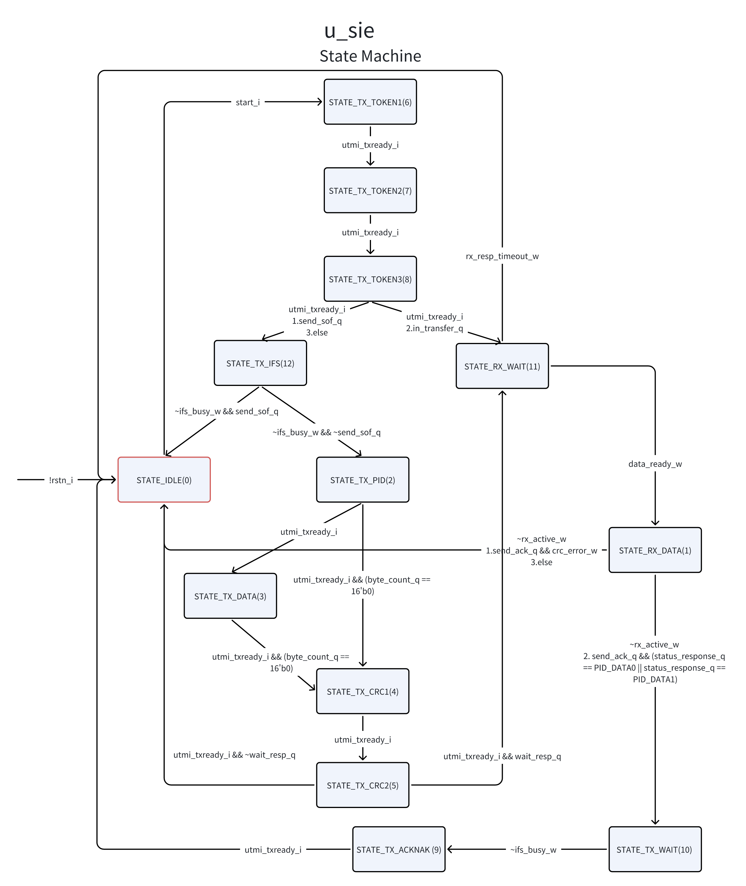
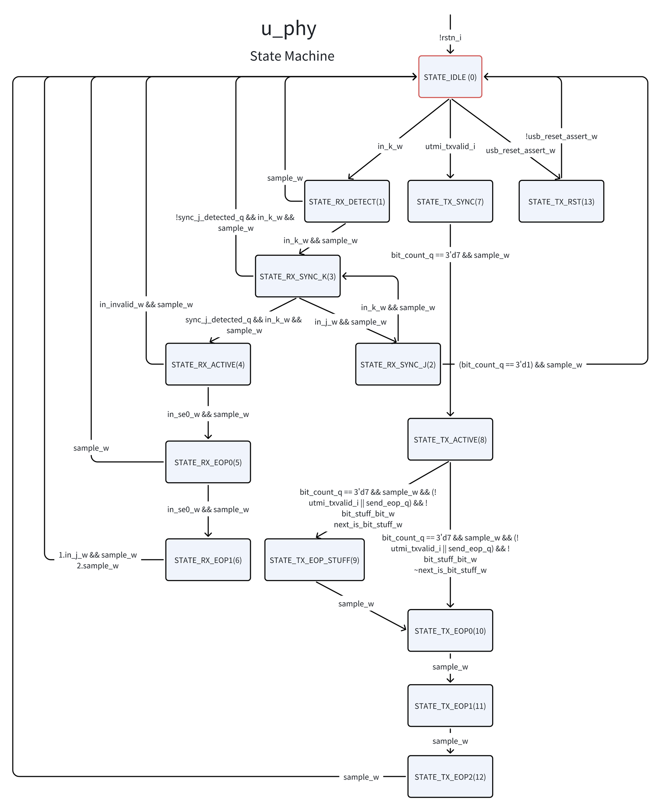
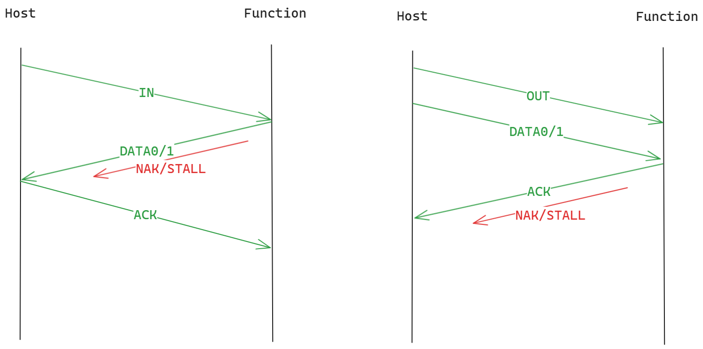
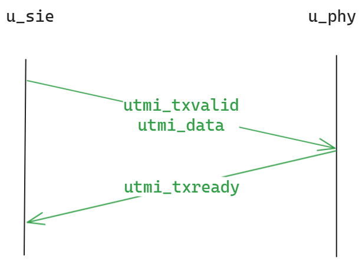

# Report
## Introduction
We referred to the USB microarchitecture in the [riscduino project](https://github.com/dineshannayya/riscduino). First, we organized the USB microarchitecture to understand the internal components of USB. According to the components and their functions, we designed prompts used ChatGPT to generate Verilog source code for USB sie, USB phy and USB transceiver respectively. In this part, we made multiple modifications of the prompts when we found that there are some limitations of GPT. Then we replaced the corresponding components with GPT generated components. Finally, we performed the functional tests and used OpenLANE to generate GDS from RTL. In addition, we also used the prompts to generate C++ source code.

## USB microarchitecture
- Reference: [usb1_host](https://github.com/dineshannayya/riscduino/tree/master/verilog/rtl/usb1_host)

### Modules
#### USB Host Controller
USB Host Controller connects with the wishbone and the pinmux. It has several modules, which are listed as follows.


- u_wb_rst: Wishbone Reset Synchronization
- u_usb_rst: USB Reset Synchronization
- u_async_wb: Async Wishbone Interface. This block does async Wishbone from one clock to other clock domain

Connections between USB Host modules are listed as follows.


#### USB Core
USB Core handles USB signal transmission, handshake protocol, error detection and correction functions to ensure reliable data transmission and communication between devices. It can be configured, read or written through registers. Its modules are listed as follows.


- usbh_fifo is a queue, which includes RAMs, registers, a read pointer, a write pointer and a counter.

A part of internal connections are listed as follows.

#### USB Sie
USB Sie is an important part in USB Core. USB Sie receives data from USB Core, passes signals and data after detecting the packet formats.  CRC-5 and CRC-16 are used to protect token and data packets.

It has a state machine, including 13 states. Sie follows the sequence to detect packets and send different signals and data. The state machine is listed as follows. In some states, Sie will send data to utmi_data_o and USB Core will receive. Then USB Host Controller receive the data,  interacting with USB Phy.


#### USB Phy
USB Phy also has a state machine, including 15 states. It will check the current state according to the signals. According to different states, it will have different actions, such as sending data, receiving data, resetting and so on. The state machine is listed as follows.


In addition, USB Phy will receive and analyse differential signals from USB Transceiver, which is related to 4 states: SE0 state, J state, K state and invalid state.

#### USB Transceiver
USB Transceiver is used to implement the data transmission of USB. According to inputs usb_phy_tx_dp_i, usb_phy_tx_dn_i and mode_i, USB Transceiver will assign outputs out_dp and out_dn the value. The table will show the situations.

| mode_i | usb_phy_tx_dp_i | usb_phy_tx_dn_i | out_dp | out_dn |
| ------ | --------------- | --------------- | ------ | ------ |
| 0      | 0               | 0               | 0      | 1      |
| 0      | 0               | 1               | 0      | 0      |
| 0      | 1               | 0               | 1      | 0      |
| 0      | 1               | 1               | 0      | 0      |
| 1      | 0               | 0               | 0      | 0      |
| 1      | 0               | 1               | 0      | 1      |
| 1      | 1               | 0               | 1      | 0      |
| 1      | 1               | 1               | 1      | 1      |

### Handshake/Interaction




## Prompts
### GPT limits
USB components is so complex that ChatGPT couldn't design directly. So we tried to tell GPT how to generate the target code. But just giving simple prompts isn't enough. GPT will not generate the code we want according to the simple prompts. We had to provide details as much and precise as possible, such as the change of one signal. At the same time, we found that GPT may ignore some sentences if the prompt was too long. So we divided long prompts into several parts and saved the important contexts.

### Strategy
Our target is to generate source code for USB sie, USB phy and USB transceiver. The original source code is quite long and complex and GPT has limited token for the contexts. We had to divide the original code into several parts based on different functions. For example, when handling USB Sie source code, we first would chat with GPT about variable definitions of USB Sie. Based on these definitions, added the state machine. Because there are quite a few actions in every state, we needed to pass the message of one state at a time , instead of sending all messages once.

### Files
The prompts folder and the relationships between prompts and generated code are listed as follows.
```
prompts
├── C++ prompts
│   ├── usb_fs_phy
│   │   ├── usb_fs_phy.cpp
│   │   ├── prompts_1.md
│   │   ├── ...
│   │   └── prompts_11.md
│   ├── usb_transceiver
│   │   ├── usb_transceiver.cpp
│   │   └── session_1.md
│   ├── usbh_sie
│   │   ├── usbh_sie.cpp
│   │   ├── session_1.md
│   │   └── session_2.md
├── usb_fs_phy
│   ├── prompts_1.txt
│   ├── ...
│   └── prompts_11.txt
├── usb_transceiver
│   └── session.txt
└── usbh_sie
    ├── session1.txt
    ├── ...
    └── session16.txt
```

|          folder          |  generated code   | prompt nums |
| ------------------------ | ----------------- | ----------- |
| usb_fs_phy(Verilog)      | usb_fs_phy.v      | 11          |
| usb_transceiver(Verilog) | usb_transceiver.v | 1           |
| usbh_sie(Verilog)        | usbh_sie.sv       | 16          |
| usb_fs_phy(C++)          | usb_fs_phy.v      | 11          |
| usb_transceiver(C++)     | usb_transceiver.v | 1           |
| usbh_sie(C++)            | usbh_sie.sv       | 2           |


## Validation
The way to verifying the generated code is to replace the originalwith the generated. Then write a configuration file, add this design and check the operation by simulation. Finally configure OpenLANE and run the code. The result will be compared with another result before replacement.

## Generate C++ code
We modified the original prompts to generate C++ code. It will be the control validation in subsequent studies. Besides, it will be used on other C++ test framework in the future.

### Strategy
Based on the steps of original prompts, The way to giving prompts is similar. We follow the original prompts. First deal with variable definitions. Then append other functions. Like USB Phy, we gave the detailed actions in every state to GPT once instead of giving all messages. But when dealing with USB Sie, we merged the prompts(sessions) about states because there were repetitive conversations(variable definitions) could be ignored in Sie prompts.
### Problems
Because of the time limit, we had no restrictions on the format of the generated C++ code. The original prompts is to generate Verilog code. We found that the generated code was in a mess because there are some Implementation such as variable definitions. For example, when GPT got an 8 bit register(`reg[7:0]`) in Verilog, it generated the C++ code that appeared these types: `int`, `bool[8]` and `bitset<8>`. And the usage of variables became precarious. We had to make more modifications on generated code. However, there maybe exists potential problems because we have no time to test the code.
