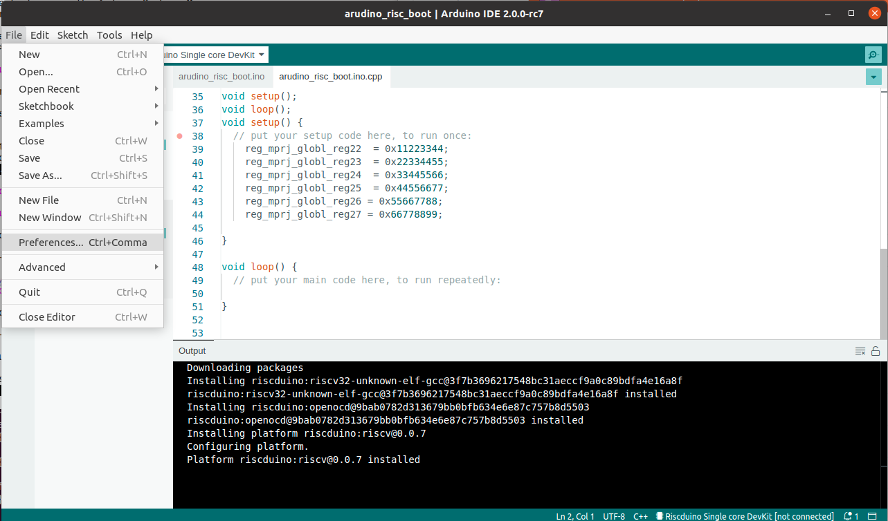
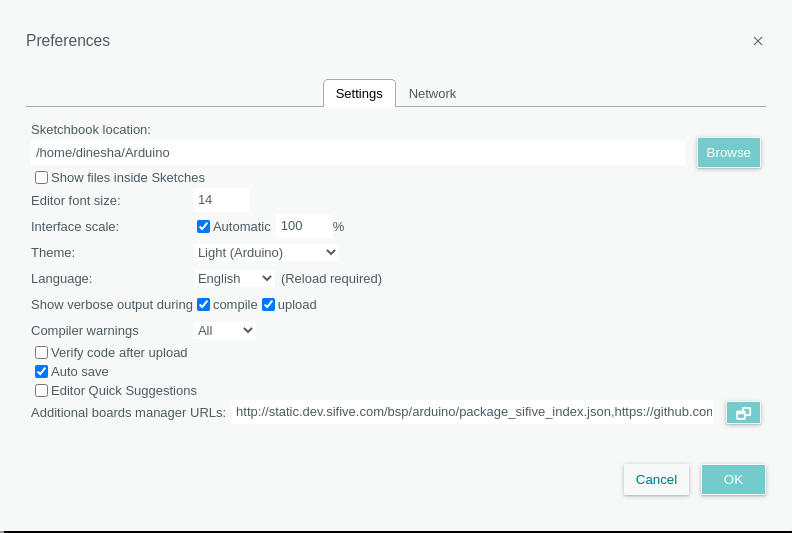
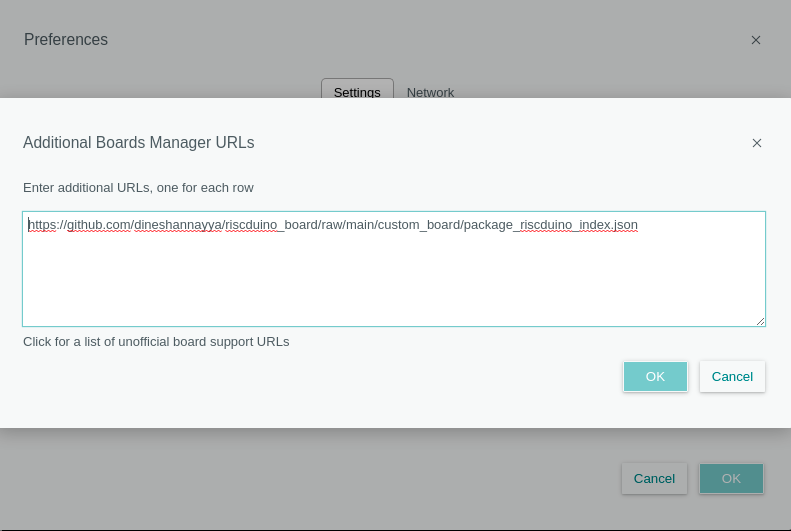
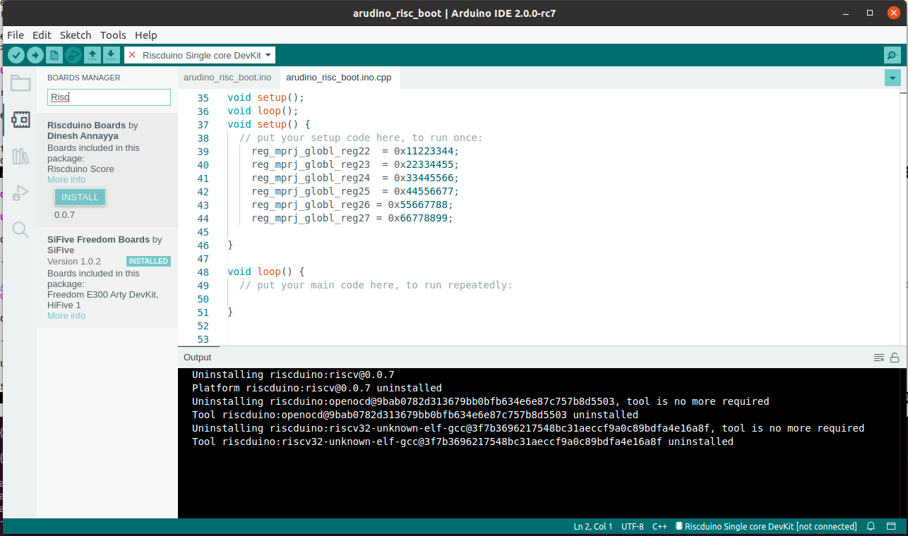
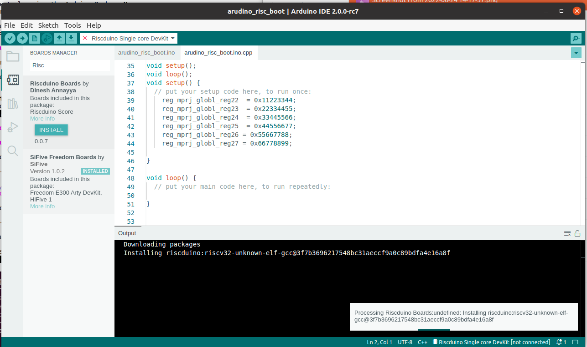
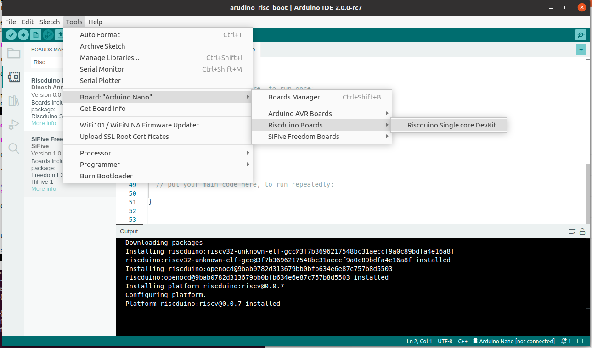

# riscduino_board
Repository for storing Arduino related files and custom board definition.
This repository allows you to program Riscduino oards using the Arduino IDE.

# Setup #

## Install Arduino ##

Download and install [Arduino IDE 2.0 tarball] (https://www.arduino.cc/en/software#experimental-software) from the Arduino website. Unpack it and run their installation script as directed.

## Install the Riscduino Boards ##

### Installing Through the Arduino IDE ###

This is supported for macOS and Linux.

1. Open the arduino-ide

2. Go to <File> <Preference>
<table>
  <tr>
    <td  align="center"></td>
  </tr>
</table>

3. Click on <Additional Board Manager URL>
   Add the [https://github.com/dineshannayya/riscduino_board/raw/main/custom_board/package_riscduino_index.json](https://github.com/dineshannayya/riscduino_board/raw/main/custom_board/package_riscduino_index.json)  
<table>
  <tr>
    <td  align="center"></td>
    <td  align="center"></td>
  </tr>
</table>

3. Close the arduino-ide  - To software to detect additional of new board URL

4. Open the arduino-ide

5. Search the riscduion under board manager
<table>
  <tr>
    <td  align="center"></td>
  </tr>
</table>

6. Install the latest Riscduino
<table>
  <tr>
    <td  align="center"></td>
  </tr>
</table>

7.  Select Your Board #
    Tools->Board-> Riscduino
 
<table>
  <tr>
    <td  align="center"></td>
  </tr>
</table>

# Command Reference

*  To get SHA256 in windows 
certutil -hashfile <example> SHA256
Example: certutil -hashfile .\riscv64-unknown-elf-toolchain-10.2.0-2020.12.8-x86_64-w64-mingw32.zip SHA256

# Reference

* **Arduino IDE: Creating Custom Boards** - https://www.hackster.io/wallarug/arduino-ide-creating-custom-boards-89f7a6
* **Arduino Platform specification** - https://arduino.github.io/arduino-cli/latest/platform-specification/
* **Adding Custom (Zero based) boards to the Arduino IDE** - https://forum.arduino.cc/t/adding-custom-zero-based-boards-to-the-arduino-ide/394499/3
* **robotics-masters** - https://github.com/robotics-masters/mm1-hat-arduino
* **Arduino core extensions for FPGA-based core** -https://github.com/f32c/fpgarduino
* **FPGArduino: a cross-platform RISC-V IDE for masses** - https://riscv.org/wp-content/uploads/2016/07/Tue1600zec_fpgarduino_riscv_wsV2.pdf
* **sifive: Freedom E300 boards using the Arduino IDE** - https://github.com/sifive/cinco

